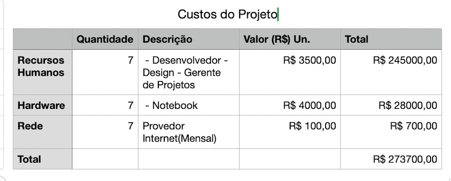

# Especificações do Projeto
A equipe identificou os desafios e requisitos para o projeto por meio de uma abordagem centrada no usuário. Pesquisas qualitativas foram realizadas para compreender as necessidades e comportamentos dos potenciais usuários. Com base nessas informações, personas e histórias de usuários foram criadas para guiar o desenvolvimento do produto. Essa abordagem ajudou a equipe a garantir uma experiência satisfatória para os usuários e fidelização dos clientes.

## Personas

Agora serão apresentadas no quadro a seguir as personas levantadas durante o processo de entendimento do problema.

Quadro 1 – Personas

| Nome | Ocupação | Motivações | Frustações |
|---|---|---|---|
| Rafaella | Auxiliar Administrativa | Recebeu a tarefa de catalogar e classificar todos os bens da empresa em que trabalha, porém nunca foi feito nenhum trabalho desses anteriormente |
| Gustavo | Empreendedor | Acabou de abrir uma pequena empresa de acessoria financeira, possui pouco funcionários porém como adquiriu computadores, mobiliarios e equipamentos novos, gostaria de manter o controle de onde e quem está utilizando cada um deles.. |
| Paulo | TI | Foi encarregado de manter o controle dos equipamentos da empresa em que trabalha, só que acha muito trabalhoso fazer isso em uma planilha |
| Beatriz | Empreendedora | Possui uma empresa de porte médio onde precisa catalogar todos os bens, desde mobiliário até frota |			

Fonte: Elaborado pelos autores com dados extraídos das entrevistas

## Histórias de Usuários

As seguintes histórias dos usuários foram registradas pelo entendimento do dia a dia das personas identificadas para o projeto.

| Pessoa | gostaria de | para |
| --- | --- | --- |
| Rafaella | Poder cadastrar os bens de maneira rápida e fácil | Conseguir entregar a tarefa dentro do prazo |
| Gustavo | Poder cadastrar os bens e quem está utilizando ele no momento | Conseguir manter uma organizão da empresa |
| Paulo | Poder cadastrar os bens utilizando diretamente o código de barra/QRCode de numeração | Facilitar o cadastro |
| Beatriz | Poder inserir fotos do bem real | Evitar confusões quanto ao modelo e marca dos bens |

## Modelagem do Processo de Negócio 

### Análise da Situação Atual

Mesmo com o avanço tecnológico, a gestão de patrimônio ainda é feita de forma arcaíca e manual, demandando tempo e recursos
da empresa. As informações do bens tangíveis são, na maioria das vezes, inseridas em planilhas onde faz com que o acompanhamento seja trabalhoso e muitas vezes difícil de manutenção.

### Descrição Geral da Proposta

O aplicativo vem para sanar essa demanda, agilizando o processo de cadastro e facilitando a atualização dos dados. E além disso faz traz a facilidade para que o gestor da empresa possa gerenciar as quantidades, os dados e mais, dos bens da sua empresa na palma da mão, em qualquer lugar que estiver.

### Processo 1 – SITUAÇÃO ATUAL

### Processo 2 – SITUAÇÃO FUTURA

## Indicadores de Desempenho

Os indicadores estabelecidos para a avaliação do desempenho do aplicativo do PatriGest, após sua disponibilização na Play Store e na Apple Store, são detalhados a seguir:

|Nº| Indicador | Objetivo | Descrição | Cálculo | Fonte de Dados | Perspectiva | Meta | Periodicidade |
|--|-----------|--------|-----------|--------|-----------|--------|-----------|-----------|
|01| Índice de avaliação na Play Store e Apple Store | Verificar a aceitação do aplicativo | Medir a média das avaliações dadas pelos usuários que baixaram e utilizaram o app  | Número de estrelas  | Play Store e Apple Store  | Qualidade do produto | Avaliação acima de 4 estrelas  | Semestral |
|02| Download      | Acompanhar crescimento do aplicativo  | Avaliar a taxa de downloads na Play Store e Apple Store | nº de downloads/período | Play Store e Apple Store  | Aumentar nº de usuários | Crescimento e Aprendizado| Mensal |
|03| Reclamações    | Verificar as reclamações recebidas  | Verificar o índice de reclamações recebidas com relação ao app e respondê-las| nº de reclamações/downloads | Play Store e Apple Store  | Qualidade do Produto | índice 0% de reclamação| Mensal |
|04| Período de inatividade   | Verificar o tempo de inatividade dos usuários em relação ao app  | Medir o intervalo de tempo médio que os usuários ficam sem utilizar o app| Média das diferenças entre as datas de acesso | Banco de dados do aplicativo  | Melhoria contínua | Atualizar informações sobre o veículo| Semestral | 

## Requisitos

As tabelas que se seguem apresentam os requisitos funcionais e não funcionais que detalham o escopo do projeto. Para determinar a prioridade de requisitos, aplicar uma técnica de priorização de requisitos e detalhar como a técnica foi aplicada.

### Requisitos Funcionais

|ID    | Descrição do Requisito  | Prioridade |
|------|------------------------------------------------------------------------------------|----|
|RF-001| O sistema deverá cadastrar os usuários do sistema. | ALTA | 
|RF-002| O sistema deverá permitir ao usuário buscar bens por filtros. | MÉDIA |
|RF-003| O sistema deverá possuir a opção de criar usuários apenas para consulta de bens | BAIXA | 
|RF-004| O sistema deverá permitir cadastrar fotos aos bens. | ALTA |
|RF-005| O usuário deverá estar logado para acessar o sistema. | ALTA |
| RF-1 | O sistema deverá cadastrar os setores da empresa, setores estes onde os bens poderão transitar. | Média |

### Requisitos não Funcionais

|ID     | Descrição do Requisito                                     |Prioridade |
|-------|-------------------------------------------------------------------|----|
|RNF-001| O sistema poderá ser acessível por vários usuários ao mesmo tempo. | ALTA | 
|RNF-002| O sistema deverá estar disponível tanto para iOS quanto Android | ALTA |
|RNF-003| Garantir boas práticas de desenvolvimento evitando um SQL Injection. | ALTA | 

## Restrições

As questões que limitam a execução do projeto são apresentadas na tabela a seguir.
			
| Código | Descrição | Prioridade |
| --- | --- | --- |
| RE-1 | A entrega de cada etapa deverá cumprir o prazo definido. | Alta | 
| RE-2 | O sistema deverá ser desenvolvido utilizando-se linguagens de programação que não requeiram licença de software paga. | Baixa |
| RE-3 | O sistema não poderá utilizar trechos de programas já existentes. | Alta |

## Diagrama de Casos de Uso

# Matriz de Rastreabilidade

A matriz de rastreabilidade é uma ferramenta usada para facilitar a visualização dos relacionamento entre requisitos e outros artefatos ou objetos, permitindo a rastreabilidade entre os requisitos e os objetivos de negócio. 

A matriz deve contemplar todos os elementos relevantes que fazem parte do sistema, conforme a figura meramente ilustrativa apresentada a seguir.

# Gerenciamento de Projeto

De acordo com o PMBoK v6 as dez áreas que constituem os pilares para gerenciar projetos, e que caracterizam a multidisciplinaridade envolvida, são: Integração, Escopo, Cronograma (Tempo), Custos, Qualidade, Recursos, Comunicações, Riscos, Aquisições, Partes Interessadas. Para desenvolver projetos um profissional deve se preocupar em gerenciar todas essas dez áreas. Elas se complementam e se relacionam, de tal forma que não se deve apenas examinar uma área de forma estanque. É preciso considerar, por exemplo, que as áreas de Escopo, Cronograma e Custos estão muito relacionadas. Assim, se eu amplio o escopo de um projeto eu posso afetar seu cronograma e seus custos.

## Gerenciamento de Tempo

O gráfico de Gantt ou diagrama de Gantt também é uma ferramenta visual utilizada para controlar e gerenciar o cronograma de atividades de um projeto. Com ele, é possível listar tudo que precisa ser feito para colocar o projeto em prática, dividir em atividades e estimar o tempo necessário para executá-las.

## Gerenciamento de Equipe

O gerenciamento adequado de tarefas contribuirá para que o projeto alcance altos níveis de produtividade. Por isso, é fundamental que ocorra a gestão de tarefas e de pessoas, de modo que os times envolvidos no projeto possam ser facilmente gerenciados. 

## Gestão de Orçamento

O processo de determinar o orçamento do projeto é uma tarefa que depende, além dos produtos (saídas) dos processos anteriores do gerenciamento de custos, também de produtos oferecidos por outros processos de gerenciamento, como o escopo e o tempo.

