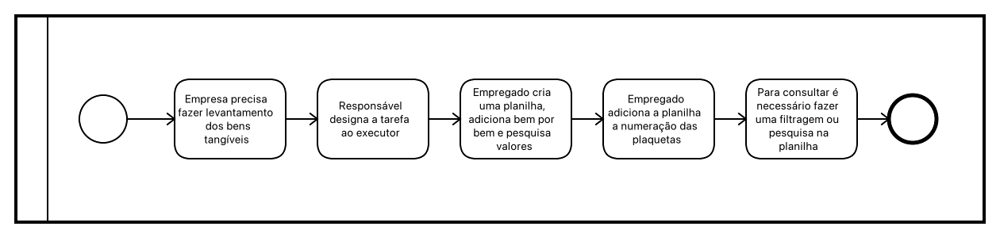
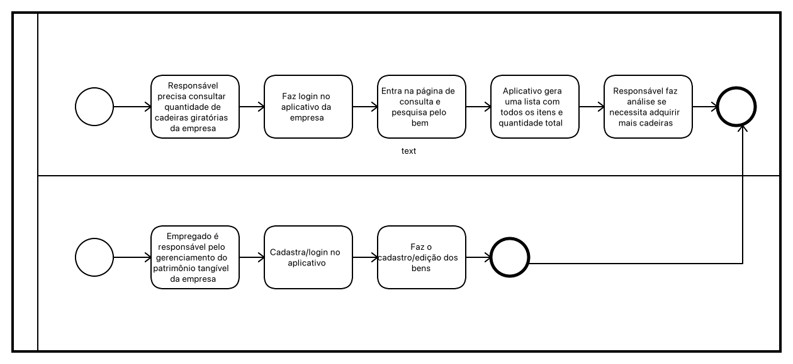
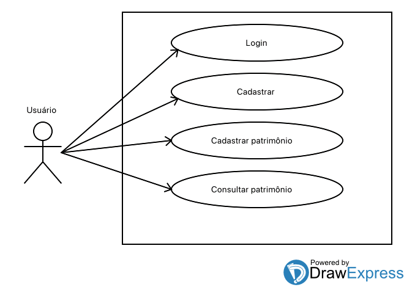
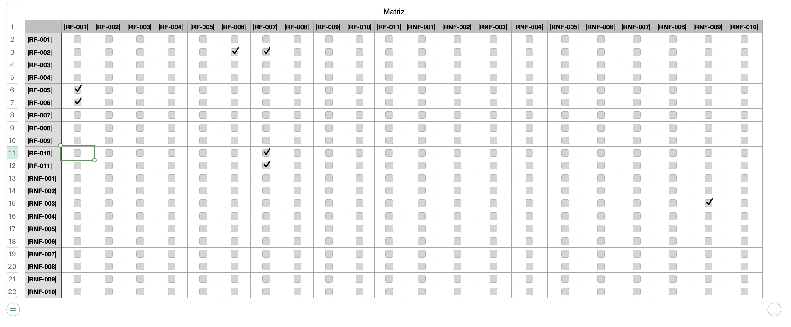
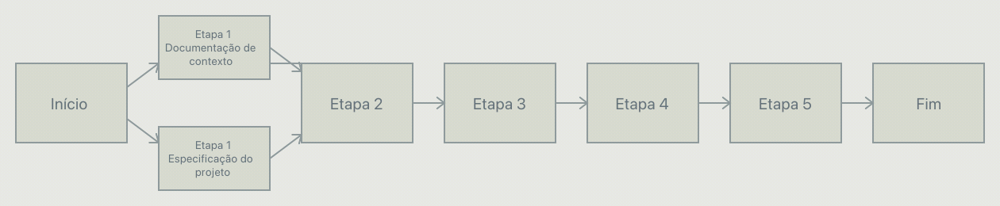
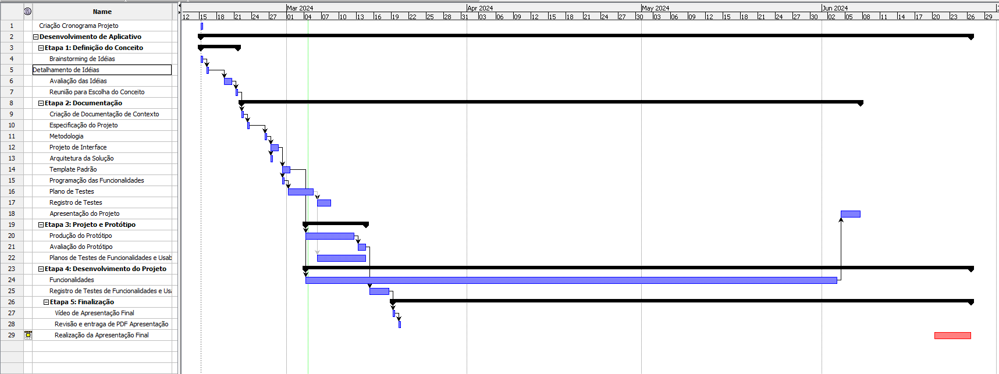

# Especificações do Projeto
A equipe identificou os desafios e requisitos para o projeto por meio de uma abordagem centrada no usuário. Pesquisas qualitativas foram realizadas para compreender as necessidades e comportamentos dos potenciais usuários. Com base nessas informações, personas e histórias de usuários foram criadas para guiar o desenvolvimento do produto. Essa abordagem ajudou a equipe a garantir uma experiência satisfatória para os usuários e fidelização dos clientes.

## Personas

Agora serão apresentadas no quadro a seguir as personas levantadas durante o processo de entendimento do problema.

Quadro 1 – Personas

| Nome | Ocupação | Motivações | Frustações |
|---|---|---|---|
| Rafaella | Auxiliar Administrativa | Recebeu a tarefa de catalogar e classificar todos os bens da empresa em que trabalha, porém nunca foi feito nenhum trabalho desses anteriormente |
| Gustavo | Empreendedor | Acabou de abrir uma pequena empresa de acessoria financeira, possui pouco funcionários porém como adquiriu computadores, mobiliarios e equipamentos novos, gostaria de manter o controle de onde e quem está utilizando cada um deles.. |
| Paulo | TI | Foi encarregado de manter o controle dos equipamentos da empresa em que trabalha, só que acha muito trabalhoso fazer isso em uma planilha |
| Beatriz | Empreendedora | Possui uma empresa de porte médio onde precisa catalogar todos os bens, desde mobiliário até frota |			

Fonte: Elaborado pelos autores com dados extraídos das entrevistas

## Histórias de Usuários

As seguintes histórias dos usuários foram registradas pelo entendimento do dia a dia das personas identificadas para o projeto.

| Pessoa | gostaria de | para |
| --- | --- | --- |
| Rafaella | Poder cadastrar os bens de maneira rápida e fácil | Conseguir entregar a tarefa dentro do prazo |
| Gustavo | Poder cadastrar os bens e quem está utilizando ele no momento | Conseguir manter uma organizão da empresa |
| Paulo | Poder cadastrar os bens utilizando diretamente o código de barra/QRCode de numeração | Facilitar o cadastro |
| Beatriz | Poder inserir fotos do bem real | Evitar confusões quanto ao modelo e marca dos bens |

## Modelagem do Processo de Negócio 

### Análise da Situação Atual

Mesmo com o avanço tecnológico, a gestão de patrimônio ainda é feita de forma arcaíca e manual, demandando tempo e recursos
da empresa. As informações do bens tangíveis são, na maioria das vezes, inseridas em planilhas onde faz com que o acompanhamento seja trabalhoso e muitas vezes difícil de manutenção.

### Descrição Geral da Proposta

O aplicativo vem para sanar essa demanda, agilizando o processo de cadastro e facilitando a atualização dos dados. E além disso faz traz a facilidade para que o gestor da empresa possa gerenciar as quantidades, os dados e mais, dos bens da sua empresa na palma da mão, em qualquer lugar que estiver.

### Processo 1 – SITUAÇÃO ATUAL

### Processo 2 – SITUAÇÃO FUTURA

## Indicadores de Desempenho

Os indicadores estabelecidos para a avaliação do desempenho do aplicativo do PatriGest, após sua disponibilização na Play Store e na Apple Store, são detalhados a seguir:

|Nº| Indicador | Objetivo | Descrição | Cálculo | Fonte de Dados | Perspectiva | Meta | Periodicidade |
|--|-----------|--------|-----------|--------|-----------|--------|-----------|-----------|
|01| Índice de avaliação na Play Store e Apple Store | Verificar a aceitação do aplicativo | Medir a média das avaliações dadas pelos usuários que baixaram e utilizaram o app  | Número de estrelas  | Play Store e Apple Store  | Qualidade do produto | Avaliação acima de 4 estrelas  | Semestral |
|02| Download      | Acompanhar crescimento do aplicativo  | Avaliar a taxa de downloads na Play Store e Apple Store | nº de downloads/período | Play Store e Apple Store  | Aumentar nº de usuários | Crescimento e Aprendizado| Mensal |
|03| Reclamações    | Verificar as reclamações recebidas  | Verificar o índice de reclamações recebidas com relação ao app e respondê-las| nº de reclamações/downloads | Play Store e Apple Store  | Qualidade do Produto | índice 0% de reclamação| Mensal |
|04| Período de inatividade   | Verificar o tempo de inatividade dos usuários em relação ao app  | Medir o intervalo de tempo médio que os usuários ficam sem utilizar o app| Média das diferenças entre as datas de acesso | Banco de dados do aplicativo  | Melhoria contínua | Atualizar informações sobre o veículo| Semestral | 

## Requisitos

As tabelas que se seguem apresentam os requisitos funcionais e não funcionais que detalham o escopo do projeto. Para determinar a prioridade de requisitos, foi aplicado uma técnica de priorização de requisitos.

### Requisitos Funcionais

|ID    | Descrição do Requisito  | Prioridade |
|------|------------------------------------------------------------------------------------|----|
|RF-001| O sistema deverá cadastrar os usuários do sistema. | ALTA | 
|RF-002| O sistema deverá permitir ao usuário buscar bens por filtros. | MÉDIA |
|RF-003| O sistema deverá possuir a opção de criar usuários apenas para consulta de bens | BAIXA | 
|RF-004| O sistema deverá permitir cadastrar fotos aos bens. | ALTA |
|RF-005| O usuário deverá estar logado para acessar o sistema. | ALTA |
|RF-006| O sistema deverá cadastrar os setores da empresa, setores estes onde os bens poderão transitar. | Média |
|RF-007| O sistema deverá cadastrar os detalhes dos bens, como marca e modelo. | Média |
|RF-008| O sistema deverá permitir cadastramento dos bens por QRCode ou nome | Média |
|RF-009| O sistema deverá poder ser usado offline | Média |
|RF-010| O sistema deverá gerar um relatório com o total de bens. |Baixa|
|RF-011| O sistema deverá permitir a edição e exclusão dos bens	|Média| 

### Requisitos não Funcionais

|ID     | Descrição do Requisito                                     |Prioridade |
|-------|-------------------------------------------------------------------|----|
|RNF-001| O sistema poderá ser acessível por vários usuários ao mesmo tempo. | ALTA | 
|RNF-002| O sistema deve ser projetado pensando na evolução de seus componentes | MÉDIA | 
|RNF-003| O sistema deverá estar disponível tanto para iOS quanto Android | ALTA |
|RNF-004| As APIs devem garantir boas práticas de desenvolvimento evitando-se um SQL Injection. | MÉDIA | 
|RNF-005| O sistema deve ser de fácil manutenibilidade  | ALTA | 
|RNF-006| O sistema deve apresentar uma baixa taxa de falhas, como travamento do aplicativo | ALTA | 
|RNF-007| O sistema deve carregar suas páginas em menos de um segundo | ALTA | 
|RNF-008| O sistema deve garantir a segurança dos dados de seus usuários | ALTA | 
|RNF-009| O sistema deve ser implementado em React Native. |Alta|
|RNF-010| O sistema deve ser implementado com Node.js como backend|	Alta|

## Restrições

As questões que limitam a execução do projeto são apresentadas na tabela a seguir.
			
| Código | Descrição | Prioridade |
| --- | --- | --- |
| RE-01 | A entrega de cada etapa deverá cumprir o prazo definido. | Alta | 
| RE-02 | O sistema deverá ser desenvolvido utilizando-se linguagens de programação que não requeiram licença de software paga. | Baixa |
| RE-03 | O sistema não poderá utilizar trechos de programas já existentes. | Alta |
| RE-04 | A entrega de cada etapa deverá cumprir o prazo definido. | Alta | 
## Diagrama de Casos de Uso

# Matriz de Rastreabilidade

A técnica MoSCoW foi aplicada para priorização dos requsitos:

Must Have (Tenho que fazer)
Should Have (Devo fazer)
Could Have (Poderia fazer)
Won’t Have (Não vou fazer)
Nesse sentido a ordem de importância das tarefas vai seguindo uma ordem decrescente, em que "Must Have" são as tarefas mais relevantes e as "Won’t Have" são tarefas que podem ficar para depois.

| Importância	| Código	|Tipo |	Critério de Aceitação |	Descrição |
| --- | --- | --- | --- | --- | 
| Must have	|RF-001| 	Funcional	|	|O sistema deverá cadastrar os usuários do sistema.|
| Should have	|RF-002| 	Funcional|	|	O sistema deverá permitir ao usuário buscar bens por filtros.|
|Must have	|RF-003| 	Funcional	|	|O sistema deverá possuir a opção de criar usuários apenas para consulta de bens|
|Must have	|RF-004| 	Funcional	|	|O sistema deverá permitir cadastrar fotos aos bens.|
|Must have	|RF-005| 	Funcional	|	|O usuário deverá estar logado para acessar o sistema.|
|Should have	|RF-006| 	Funcional| |		O sistema deverá cadastrar os setores da empresa, setores estes onde os bens poderão transitar.|
|Should have	|RF-007| 	Funcional| |		O sistema deverá cadastrar os detalhes dos bens, como marca e modelo.|
|Must have	|RF-008| 	Funcional|		|O sistema deverá permitir cadastramento dos bens por QRCode ou nome|
|Could have	|RF-009| 	Funcional|		|O sistema deverá poder ser usado offline|
|Could have	|RF-010|	Funcional|		|O sistema deverá gerar um relatório com o total de bens.|
|Could have	|RF-011|	Funcional|		|O sistema deverá permitir a edição e exclusão dos bens|
|Must have	|RNF-001| 	Não-Funcional|	|	O sistema poderá ser acessível por vários usuários ao mesmo tempo. |
|Should have	|RNF-002| 	Não-Funcional| |		O sistema deve ser projetado pensando na evalução de seus componentes|
|Must have	|RNF-003| 	Não-Funcional|	|	O sistema deverá estar disponível tanto para iOS quanto Android|
|Could have	|RNF-004| 	Não-Funcional|	|	Garantir boas práticas de desenvolvimento evitando um SQL Injection.|
|Should have	|RNF-005| 	Não-Funcional| |		Deve ser de fácil manutenbilidade|
|Must have	|RNF-006| 	Não-Funcional|		|Deve ter baixa taxa de falhas |
|Should have	|RNF-007| 	Não-Funcional|	|	O sistema deve carregar suas páginas em menos de um segundo|
|Must have	|RNF-008| 	Não-Funcional|		|O sistema deve garantir a segurança dos dados de seus usuários |
|Must have	|RNF-009| 	Não-Funcional|		|O sistema deve ser implementado em React Native|
|Must have	|RNF-010| 	Não-Funcional|		|O sistema deve ser implementado com Node.js como backend|

Ao longo do projeto, os requisitos podem mudar e o impacto desta mudança deve ser analisado e os riscos avaliados. "Para que a análise de impacto de uma mudança possa ser realizada de forma adequada, é necessário garantir que as ligações entre os requisitos ou entre os requisitos e outros elementos do sistema sejam conhecidas e possam ser utilizadas como base para essa análise." (REINEHR, 2020).

# Gerenciamento de Projeto

De acordo com o PMBoK v6 as dez áreas que constituem os pilares para gerenciar projetos, e que caracterizam a multidisciplinaridade envolvida, são: Integração, Escopo, Cronograma (Tempo), Custos, Qualidade, Recursos, Comunicações, Riscos, Aquisições, Partes Interessadas. Para desenvolver projetos um profissional deve se preocupar em gerenciar todas essas dez áreas. Elas se complementam e se relacionam, de tal forma que não se deve apenas examinar uma área de forma estanque. É preciso considerar, por exemplo, que as áreas de Escopo, Cronograma e Custos estão muito relacionadas. Assim, se eu amplio o escopo de um projeto eu posso afetar seu cronograma e seus custos.

## Gerenciamento de Tempo
Segundo Vargas (2018), o gerenciamento do cronograma tem como principal objetivo garantir que o projeto seja concluído dentro do prazo determinado.

Com diagramas bem organizados, que permitem gerenciar o tempo nos projetos, o gerente de projetos agenda e coordena tarefas dentro de um projeto para estimar o tempo necessário de conclusão.

Para construir um bom diagrama, deve-se partir de um conjunto de atividades definidas, sequenciando-as de acordo com as dependências conhecidas entre si, estimando as durações das atividades individualmente e desenvolvendo a estrutura do projeto, em termos das tarefas e suas interações. É preciso, ademais, definir uma abordagem de ciclo de vida mais adequada ao projeto em questão.

O diagrama de rede pode ser entendido como um gráfico que mostra as tarefas que precisam ser realizadas para a finalização de um projeto. Além de mostrar as relações contínuas de atividades, mostra como fazer as atividades e o cronograma determina quando fazer as tarefas do projeto.

O gráfico de Gantt ou diagrama de Gantt também é uma ferramenta visual utilizada para controlar e gerenciar o cronograma de atividades de um projeto. Com ele, é possível listar tudo que precisa ser feito para colocar o projeto em prática, dividir em atividades e estimar o tempo necessário para executá-las.

## Gerenciamento de Equipe

O eficaz gerenciamento do tempo é crucial para garantir que o projeto Gest-Patri atinja altos níveis de produtividade. É imperativo realizar uma gestão eficiente das tarefas e das equipes envolvidas para garantir o sucesso do projeto.

A Gestão do Tempo e a Coordenação de Tarefas, juntamente com a infraestrutura utilizada para gerenciamento de recursos, são detalhadas na seção de Metodologia.

A seguir, delineamos o planejamento que guiará e facilitará o gerenciamento de tempo durante o projeto.

>**Planejar o uso do tempo**

- Estabelecer métodos para gerenciar efetivamente o tempo do projeto;
- Obter documentação relevante para o desenvolvimento do projeto;
- Atribuir responsabilidades aos membros da equipe;
- Elaborar um cronograma de atividades;
- Estimar a alocação de tempo para as atividades.

>**Analisar e quantificar o tempo necessário para cada atividade**
- Recursos humanos: desenvolvedores e gerentes de projeto;
- Recursos materiais: seis computadores com software de desenvolvimento instalado;
- Acesso ao MarvelApp;
- Adquirir recursos temporais

>**Recursos**
Acesso ao MarvelApp através de contas vinculadas (Gmail);
Envolvimento dos alunos e membros da equipe como desenvolvedores e gerentes;
Desenvolver habilidades da equipe

>**Atualização da equipe**
- Treinamento da equipe em React Native;
- Treinamento da equipe em gerenciamento de tempo e projetos;
- Treinamento na utilização do MarvelApp;
- Desenvolvimento de habilidades interpessoais.
- Gerenciar o tempo da equipe

>**Manter a documentação atualizada**
- Considerar outros fatores que possam influenciar no uso do tempo do projeto;
- Planejar as entregas de acordo com o cronograma;
- Atualizar o plano de gerenciamento do tempo conforme necessário.
- Controlar o uso do tempo

>**Controle de desvio**
- Identificar e controlar os motivos;
- Determinar se o desvio é devido a erro ou falta de conhecimentos;
- Corrigir problemas identificados;
- Replanejar a tarefa se for necessário;
- Monitorar o desempenho e o progresso das atividades;
- Atualizar o plano de gerenciamento do tempo com base nas informações obtidas.

## Gestão de Orçamento

|  | Quantidade | Descrição | Valor Unitário | Valor Total | 
| --- | --- | --- | --- | --- |
| Recursos Humanos | 7 | - Desenvolvedor - Designer - Gerente de projetos | R$ 3.500,00 | R$ 245.000,00 | 
| Hardware | 7 | Notebook | R$ 4.000,00 | R$ 28.000,00 | 
| Rede | 7 | Internet Local - Provedor de Acesso | R$ 100,00 | R$ 700,00 |
| TOTAL| |  |  | R$ 273.700,00 |

