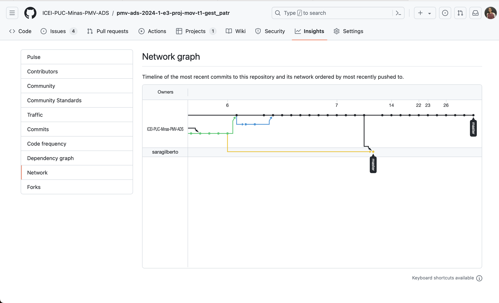
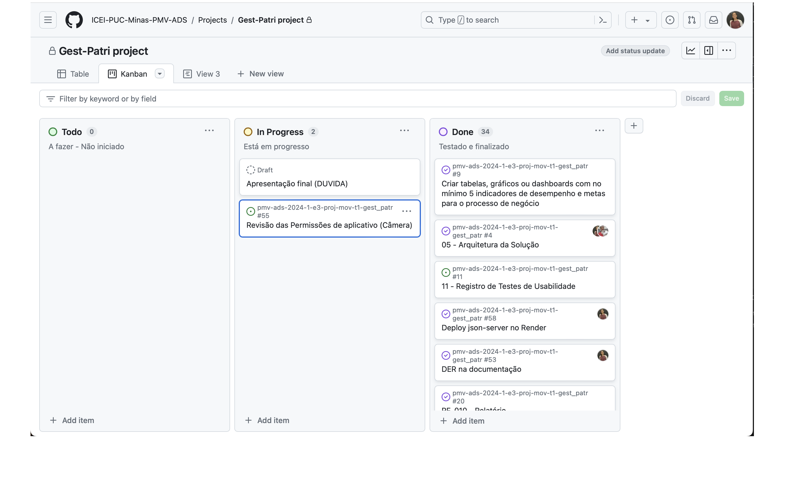
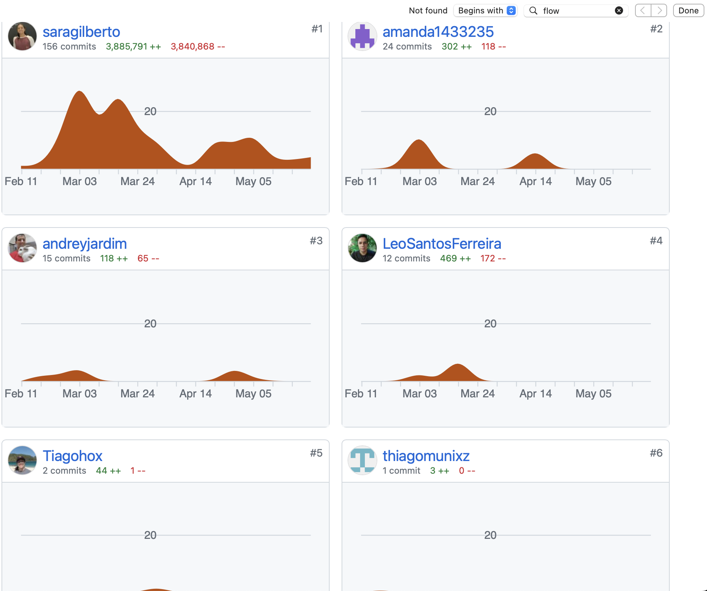

# Metodologia

Pré-requisitos: <a href="2-Especificação do Projeto.md"> Documentação de Especificação</a>

Descreva aqui a metodologia de trabalho do grupo para atacar o problema. Definições sobre os ambiente de trabalho utilizados pela  equipe para desenvolver o projeto. Abrange a relação de ambientes utilizados, a estrutura para gestão do código fonte, além da definição do processo e ferramenta através dos quais a equipe se organiza (Gestão de Times).

## Relação de Ambientes de Trabalho

Os artefatos do projeto são desenvolvidos a partir de diversas plataformas e a relação dos ambientes com seu respectivo propósito deverá ser apresentada em uma tabela que especifica que detalha Ambiente, Plataforma e Link de Acesso. 
Nota: Vide documento modelo do estudo de caso "Portal de Notícias" e defina também os ambientes e frameworks que serão utilizados no desenvolvimento de aplicações móveis.

## Controle de Versão

A ferramenta de controle de versão adotada no projeto foi o
[Git](https://git-scm.com/), sendo que o [Github](https://github.com)
foi utilizado para hospedagem do repositório.

O projeto segue a seguinte convenção para o nome de branches:

- `master`: versão estável já testada do software
- `realease`: versão já testada do software, porém instável
- `testing`: versão em testes do software
- `dev`: versão de desenvolvimento do software
- `hotfix`: versão de correção de erros
- `feature`: versão de implementação de novas funcionalidades

Quanto à gerência de issues, o projeto adota a seguinte convenção para
etiquetas:

- `doc`: melhorias ou acréscimos à documentação
- `bug`: uma funcionalidade encontra-se com problemas
- `enhancement`: uma funcionalidade precisa ser melhorada
- `feature`: uma nova funcionalidade precisa ser introduzida

O uso dessas práticas de gerenciamento de branches, tags e issues no GitHub ajuda a manter o projeto organizado, facilita a colaboração entre os membros da equipe e promove um desenvolvimento mais eficiente e controlado do software.

## Gerenciamento de Projeto

### Divisão de Papéis

 A equipe utiliza metodologias ágeis, tendo escolhido o Scrum como base para definição do processo de desenvolvimento. A equipe está organizada da seguinte maneira:
- Scrum Master: Amanda ;
- Product Owner: Sara Pereira;
- Equipe de Desenvolvimento: Andrey Bibiano, Tiago, Leonardo;
- Equipe de Design: Thiago, Leonardo.

### Processo

 

### Controle contribuição do Time

### Ferramentas

As ferramentas empregadas no projeto são:

| Ferramenta | Descrição | 
| --- | --- | 
| Editor de código | VSCode, Geany | 
| Ferramentas de comunicação | MS Teams, Whatsapp | 
| Ferramentas de desenho de tela | DIA, Canvas, Excel, DrawExpress, MARVEL APP |

O editor de código foi escolhido porque ele possui uma integração com o sistema de versão, e era um editor já conhecido de todos os membros da equipe. As ferramentas de comunicação utilizadas possuem integração semelhante e por isso foram selecionadas. Por fim, para criar diagramas utilizamos a ferramenta DrawExpress, por ter uma versão gratuita e também ser de fácil aprendizagem. 

Liste quais ferramentas foram empregadas no desenvolvimento do projeto, justificando a escolha delas, sempre que possível.
 

