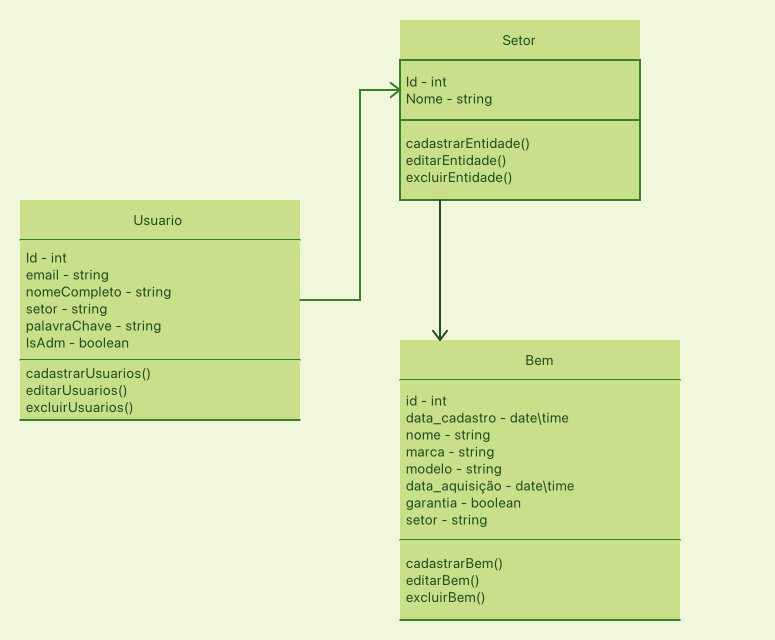
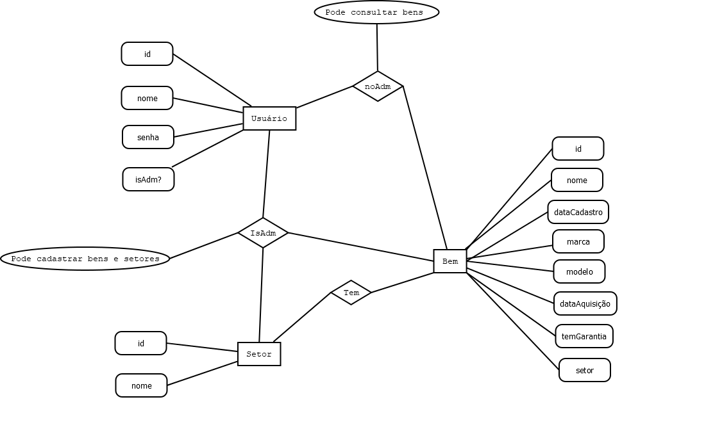
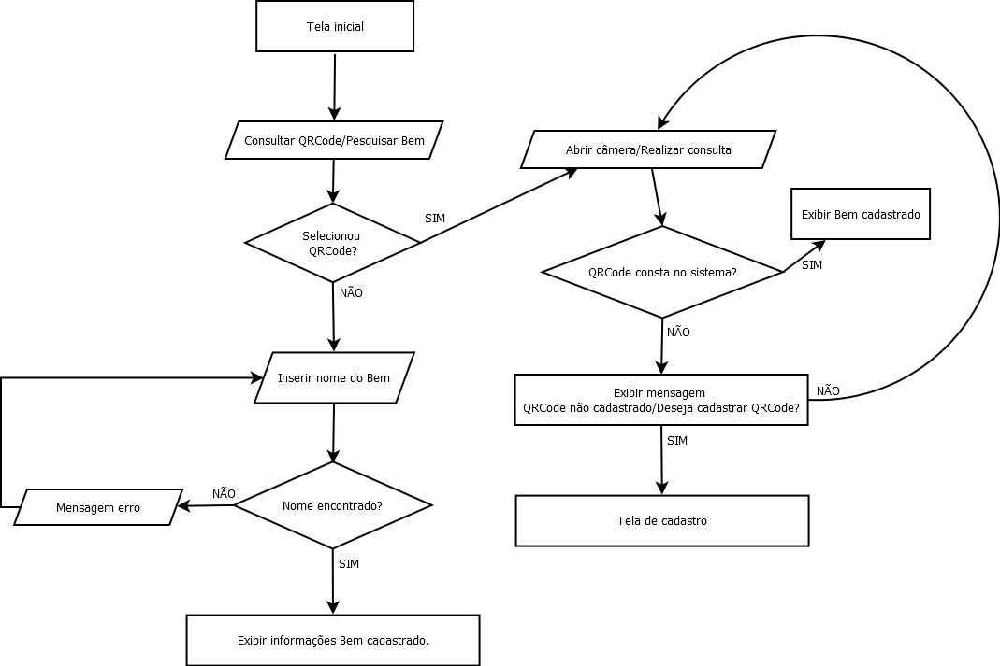
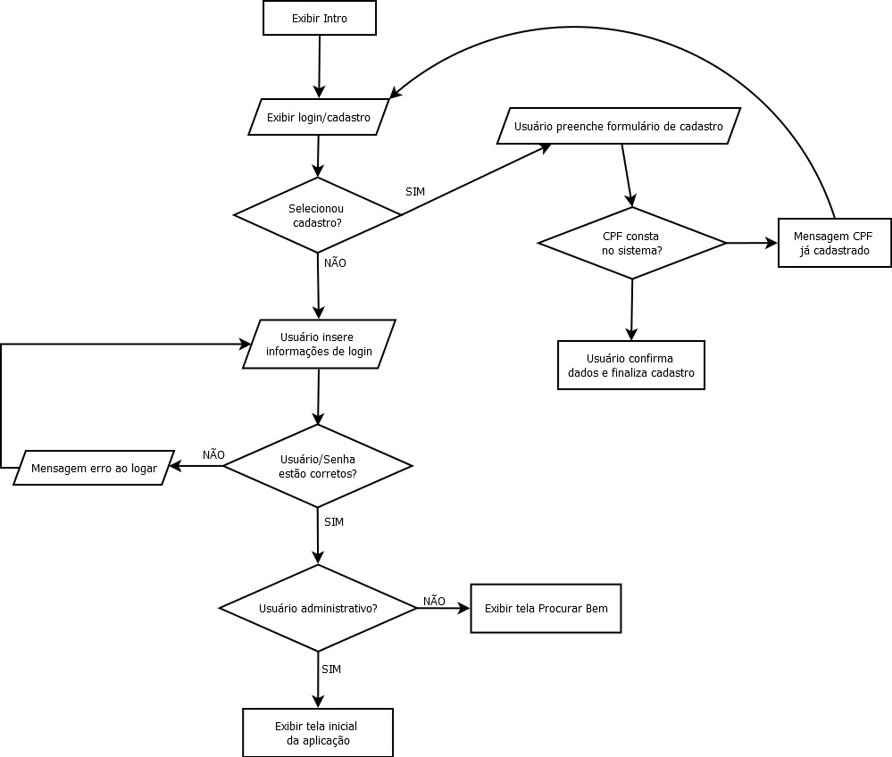
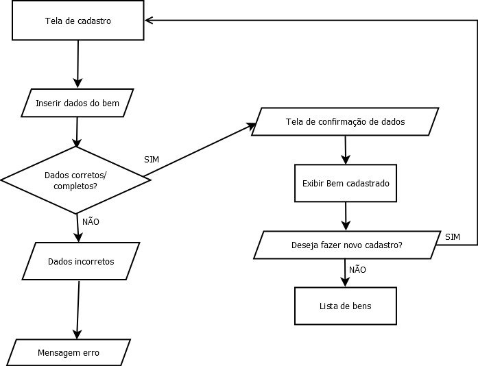

# Arquitetura da Solução

Pré-requisitos: <a href="3-Projeto de Interface.md"> Projeto de Interface</a>

Definição de como o software é estruturado em termos dos componentes que fazem parte da solução e do ambiente de hospedagem da aplicação.

## Diagrama de Classes

O diagrama de classes ilustra graficamente como será a estrutura do software, e como cada uma das classes da sua estrutura estarão interligadas. Essas classes servem de modelo para materializar os objetos que executarão na memória.

## Modelo ER

O Modelo ER representa através de um diagrama como as entidades (coisas, objetos) se relacionam entre si na aplicação interativa.

.

## Esquema Relacional

O Esquema Relacional corresponde à representação dos dados em tabelas juntamente com as restrições de integridade e chave primária.
 

## Tecnologias Utilizadas

> - Linguagem: JavaScript
> - Frameworks: React Native
> - Biblioteca: React Native Paper (biblioteca de componentes Interface do Usuário)
> - IDE: Visual Studio Code, WebStorm jetBrains
> - Ferramenta Wireframes: MarvelApp
> - Ferramenta de Comunicação: Whatsapp e Teams
> - Ferramenta de Gestão de Projeto: Github Projects
> - Ferramentas de versionamento: Github Desktop
> - API RESTful: JSON Server
> - Outras ferramentas: Expo CLI

## Hospedagem

Explique como a hospedagem e o lançamento da plataforma foi feita.

> **Links Úteis**:
>
> - [Website com GitHub Pages](https://pages.github.com/)
> - [Programação colaborativa com Repl.it](https://repl.it/)
> - [Getting Started with Heroku](https://devcenter.heroku.com/start)
> - [Publicando Seu Site No Heroku](http://pythonclub.com.br/publicando-seu-hello-world-no-heroku.html)

## Qualidade de Software

As métricas de qualidade do software Gest-Patri será baseada na norma ISO/IEC 25010. Os atributos e subcaracterísticas em ordem de peso/prioridade são:

**Funcionalidade**
Integridade funcional para cobertura de todas as tarefas e objetivos propostos pelo software;
Correção funcional ao prover os resultados corretos;
Adequação funcional medindo o quão bem consegue realizar suas tarefas 

**Usabilidade**

A usabilidade é uma característica importante pois assim podemos realizar eficientemente os objetivos do produto. 
Adequação reconhecível;
Capacidade de aprendizado ;
Operabilidade;
Compreensibilidade;

**Segurança e Compatibilidade**
Confidencialidade, integridade e disponibilidade do sistema para manter informações cadastradas de forma segura no sistema e garantir integridade delas como um todo. Além disso, a compatibilidade define a facilidade e segurança que o sistema possui em poder trocar informações com um sistema terceiro. 

**Manutenibilidade**

Conformidade com os requisitos impostos;
Modificabilidade que define a facilidade de realizar modificações no produto;
Testabilidade para garantir que as modificações e as funcionalidades existem persistem em pleno funcionamento;
